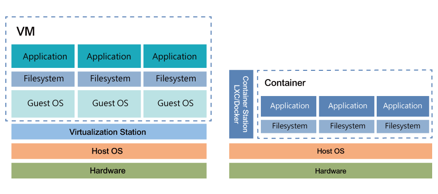
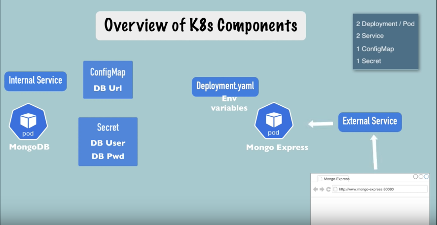

# Docker and Kubernetes

## Docker

### What is docker?
Tool for running an application in isolated environment. Similar to VM

### Container Vs Virtual Machine

### Installing Docker

you can follow this [link](https://hub.docker.com/) to install docker.

If you are using linux operation system try [rootless docker](https://docs.docker.com/engine/security/rootless/).

For linux, don't forget to set environment variable or add them to /home/username/.bashrc

### Docker Commands

Once docker is installed, you can verify by typing `docker` in your terminal.

Command | Description
--------|----------
`docker pull <image name>` | Pull docker image from docker hub.
`docker ps` or `docker container list` | List running container.
`docker ps -a` | List all instance of container.
`docker ps -aq` | List ids in all instance of container.
`docker run nginx:latest` | Run latest ngnix docker image in attach mode.
`docker run -d nginx:latest` | Run latest nginx docker image in detach mode.
`docker run -d --name <name> <img_name>` | Give a name to an instance of an image
`docker run -d -p <computer port>:<app port> nginx:latest` | Run latest ngnix docker image bind to custom computer port.
`docker stop <hash>/<name>` | Stops running docker image
`docker start <hash>/<name>` | Start the instance of a container.
`docker rm <hash>/<name>` | Remove docker image instance.
`docker images` | List of all downloaded images.
`docker exec -it <name> bash` | Open bash terminal in docker instace.

### Volumes 

Volumes are used to share data between host and container or container to container.

`docker run -v <host folder>:<docker mount point>:<mode>`

Example:

`docker run --name website -v $(pwd):/usr/share/me:ro`

This command shares the current directory to docker image in the location */usr/share/me*.

#### Modes
`ro` - ReadOnly

#### Volumes from another container

`volumes-from` allows to share the volumes across the containers.

`docker run --volumes-from <instance-name>`

Example:

`docker run --name website-copy --volumes-from website -d -p 8081:80`

### Dockerfile

Dockerfile helps in creating your own docker images. you can find command [here](https://docs.docker.com/engine/reference/builder/).

### Build Docker Image

After you created a Dockerfile in your project, you can build it as an image using a command

`docker build .`

'.' specifies that the dockerfile is in your current location.

Example:

`docker build --tag website:latest .`

Created dockerfile can be seen using `docker images`.

### .Dockefileignore

we can place a files path needs to be ignored while creating docker images.

Example:
`*.out` - excludes all files ends with `out` extension

### Caching and Layers

Each step in docker file is layer and it is using caching.

**Hint**: Add libraries before adding source code in Dockerfile. It will speed up the bulid process.

### Alpine

[AlpineLinux](https://alpinelinux.org/) is simple and secure. This helps to reduce the docker image size.

### Tags, Versions and Tagging

* Allows you to control image version
* Avoid breaking changes
* Safe

You can find versions of base images in docker hub.

### Tagging Own Images

Tagging allows you to maintain the history of your software builds.

Example

`docker tag <image-name>:latest <image-name>:version-number`

Above command changes your image from latest version to some version number.

### Docker Registries

* Highly scalabe server side appliacation hat stores and lets you distribute Docker images.
* Used in your CD/CI  Pipeline.
* Run your applications.

#### How to push your own images to dockerhub

* Login to [Dockerhub](https://hub.docker.com/)
* Create a repository (public/private)
* Inside repository you will see the command to push the image
* Rename your local images according to the tag given in repo by `dcoker tag <current name> <name to change>`
* Now use the push command given in your repo

Example

`docker push sampleid/example:latest`

### Pull your own images

In dockerhub overview of your dockerhub page you will find pull command.

`docker pull sampleid/example`

### Docker Inspect

`docker inspect <containerid>`

### Viewing Logs

Shows logs of the container and other logs in the application.

`docker logs -f <container id>`

Above example will shows the live logs of the container.

### Docker Exec

This helps to run a command in a running container.

`docker exec -it conatiner "echo a&& echo b"`

`docker exec -it container /bin/bash`

The above example opens bash shell in running container.

## Kubernetes

### About Kubernetes

* Opensource container orchestration tool
* Developed by Google
* Helps to manage containerized applications in different deployment environments.

### Orchestartion tools features

* High Availability or no downtime.
* Scalability or high performance.
* Disaster recovery - backup and restore.

### Kubernets Componentes

#### Node and Pod

##### Node

Node is a virtual machine or server.

##### Pod

* Smallest unit of K8s
* Abstraction over container
* Usually 1 application per pod.
* Each pod gets its own ip address (communicate with other pods)
* Pods can die easily if it died new one will be created with new ip address.

##### Service

* Permanent IP address
* Lifecycle of Pod and Service is not connected

### Minikube

Test on local machine?

Directly working with Kubernetes components is difficult.

Minikube is a opensource tool which is one node cluster with master precesses and worker processes. Docker is installed in it.

Minikube create virtualbox in your laptop which we can use for testing purposes.

### Kubectl

Kubectl is a comand line tool to access kubernet components inside Minikube.

### Installation of Minikube and Kubectl

Install Minikube as instructed [here](https://minikube.sigs.k8s.io/docs/start/)

you can check the version of Minikube by `minikube version`

Minikube comes with Kubectl you can use Kubectl by `minikube kubectl -- get nodes`

----

**Note**: For easier use, I recommend to use alias. For creating alias add the following lines to the end of **~/.bashrc** file.

`sudo nano ~/.bashrc` to open .bashrc file

`alias kubectl="minikube kubectl --"`

----

Before installing Minikube install virtualbox using `sudo apt install virtualbox`

**Note**: *If you already installed any VM Manager, above step is not necessary and you can use any other VM Managers like KVM, VMWare, etc...)*

### Start Minikube

Once installation is completed, you can start Minikube using `minikube start --driver=virtualbox`

Above command will start the Minikube instance. Once it is started, you can check it using `minikube status` or `kubectl get nodes`

*Minikube CLI* is useful for creating and deleting the nodes, for configuring the node we have to use *Kubectl*.

### Creating Deployment

`kubectl get service` - list the service available

You cannot create a pod directly, there is an abstraction layer on it which is called deployment. Deployment will create pods.

Following command is used to create a pod.

`kubectl create deployment <name> --image=<image-name>`

Example

`Kubectl create deployment nginx-deployment --image=nginx`

This command create deployment with an nginx image with the name of 'nginx-deployment'.

### Debugging Pods

`kubectl describe pod <podname>` shows information about the pod.

To view the logs generated by pod use the following command.
`kubectl logs <podname>`

`kubectl exec -it pod-name -- bin/bash` - opens terminal inside the pod.

### Kubectl Apply -F

While creating deployment you may need to provide a lot of inputs as args. In practical, you can give an configuration file which provides all necessary configuration.

`kubectl apply -f [config-file]` - Create deployment using config file.

Example

`kubectl apply -f nginx-deployment.yaml`

### Deploying Mongo-Express and Mongodb

#### Overview

